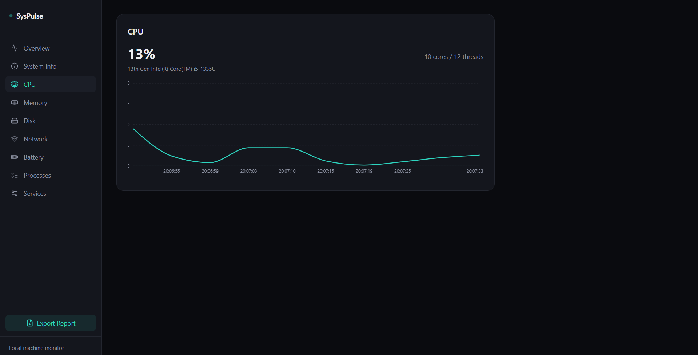
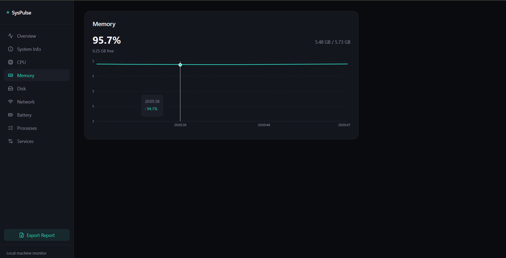
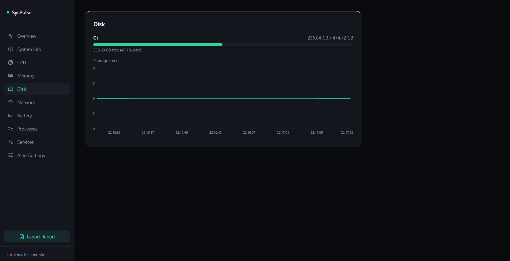
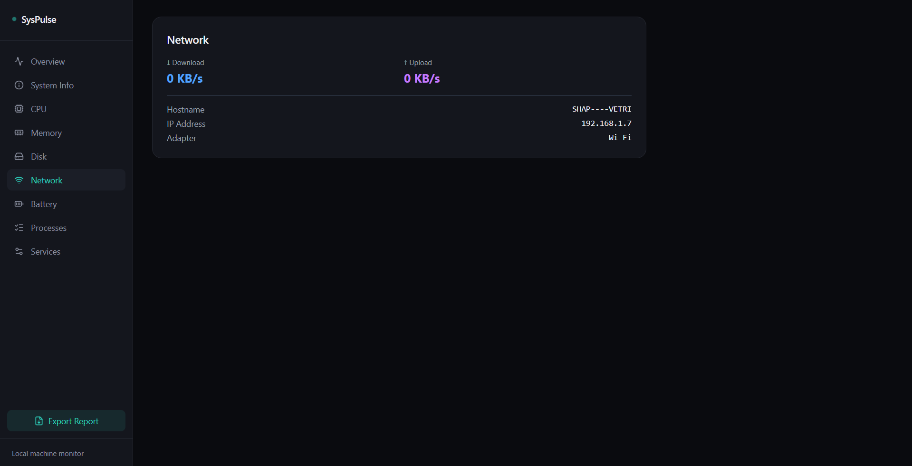
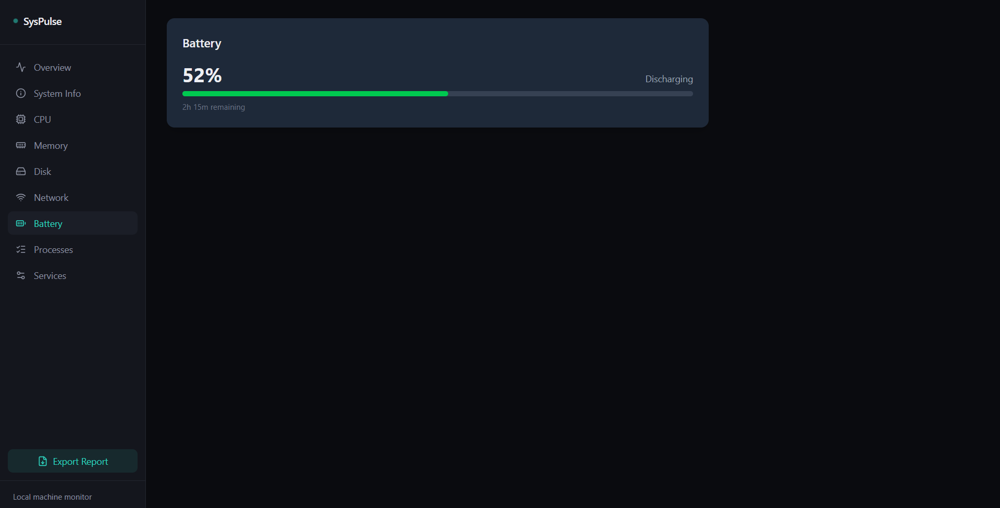
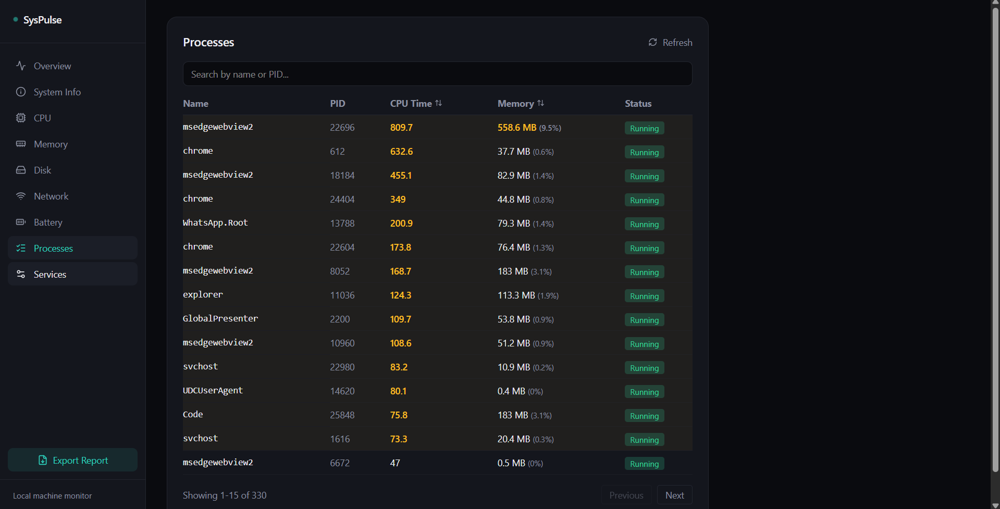
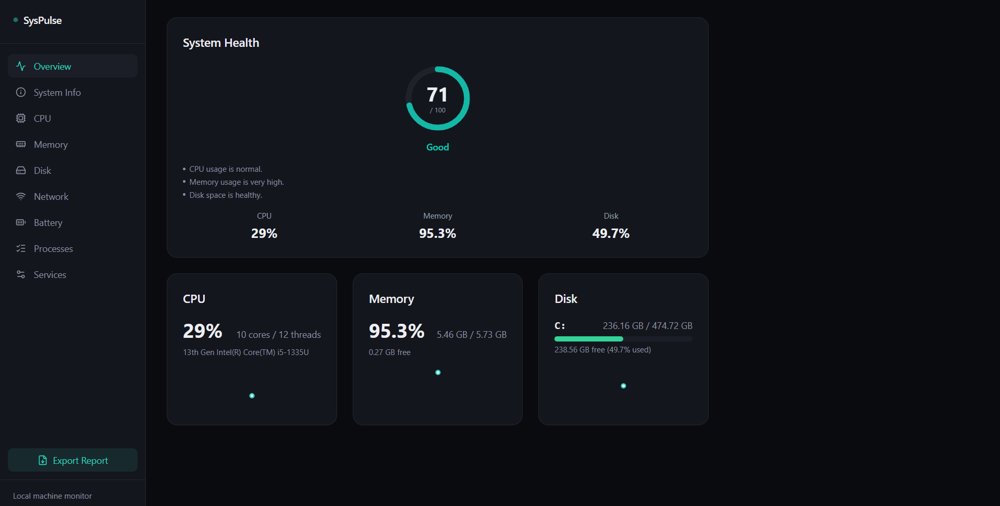
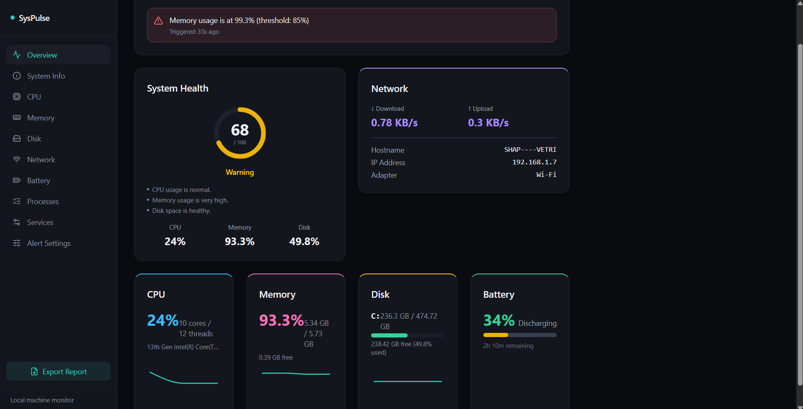
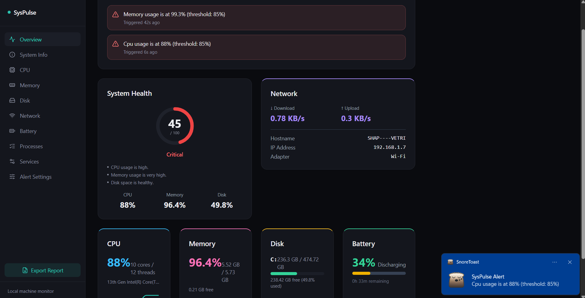

# SysPulse — Enterprise System Health Monitoring Dashboard

A real-time desktop system monitoring dashboard for Windows, built to bring enterprise-style
observability (inspired by tools like ManageEngine AppManager) to a local machine — live resource
metrics, deep system diagnostics, process management, alerting, and automated health reporting,
all in a clean, self-built dark UI.


## Why I built this

I built SysPulse after a software development internship at Zoho Corporation (ManageEngine),
where I got hands-on exposure to how real IT infrastructure monitoring tools are architected —
metric collection pipelines, alerting systems, and dashboards used to keep enterprise systems
healthy. SysPulse is my attempt to build a lightweight, modern version of that experience from
the ground up: not a tutorial clone, but a project where I made real architectural decisions
(and hit real production-style problems — timeouts under concurrent load, PowerShell process
overhead, CORS conflicts, duplicate polling) and had to actually solve them.

## Screenshots

| Overview | CPU Monitoring |
|---|---|
|  |  |

| Memory | Disk |
|---|---|
|  |  |

| Network | Battery |
|---|---|
|  |  |

| Process Explorer | System Information |
|---|---|
|  |  |

| Alert Settings |
|---|
|  |

### System Health Score — states

| Good | Warning | Critical |
|---|---|---|
|  |  |  |

## Features

- **Live metrics** — CPU, Memory, Disk, Network, and Battery, pushed in real time over WebSockets
  with 60-second rolling trend charts
- **Deep System Information** — hardware, BIOS, OS build, storage, and network identity in one
  grouped view
- **Process Explorer** — search, sort, paginate through every running process, with a details
  drawer (path, start time, thread count)
- **Windows Services browser** — live status with search and filtering
- **PDF health report export** — one-click, auto-generated report covering every monitored
  metric and the top running processes
- **Configurable alerting** — set your own CPU/Memory/Disk thresholds; a background monitor
  checks continuously and fires native Windows toast notifications on breach
- **In-memory caching layer** — decouples data collection from request/broadcast frequency to
  avoid redundant native system calls under concurrent load

## Tech stack

**Frontend:** React, Tailwind CSS, Recharts, Socket.io-client, Axios
**Backend:** Node.js, Express, Socket.io, `systeminformation`
**System data:** [`systeminformation`](https://systeminformation.io/) (native Node bindings —
no shelling out to PowerShell)

## Architecture
React Dashboard (Vite)
│
REST API + WebSocket (Socket.io)
│
Express Backend
│
In-memory Cache Layer ──► systeminformation
│
Background Services: Alert Monitor · Metric Broadcaster
│
Windows OS / Hardware


Live metrics (CPU/Memory/Disk/Network/Battery) are pushed to the frontend over a single
persistent WebSocket connection rather than polled — a background broadcaster service reads from
the shared cache every few seconds and emits updates to all connected clients. Heavier data
(Process Explorer, Services, System Info, PDF export) uses REST endpoints, since that data is
requested less frequently and doesn't need push updates. An independent alert-monitoring loop
runs on its own schedule, checking cached metrics against user-configured thresholds and firing
native OS notifications on breach — decoupled entirely from whatever the frontend happens to be
polling or displaying at any given moment.

## Getting started

### Prerequisites
- Node.js 18+
- Windows (uses Windows-specific system data via `systeminformation`)

### Backend
```bash
cd syspulse-backend
npm install
node server.js
```
Runs on `http://localhost:5000`.

### Frontend
```bash
cd syspulse-frontend
npm install
npm run dev
```
Runs on `http://localhost:5173`.

Open `http://localhost:5173` in your browser — the dashboard connects to the backend
automatically over both REST and WebSocket.

## Project structure
syspulse/
├── syspulse-backend/
│ └── src/
│ ├── services/ # metric collection (cached, systeminformation-backed)
│ ├── controllers/ # request handling
│ ├── routes/ # Express route definitions
│ └── utils/cache.js # in-memory cache with TTL + in-flight de-duplication
├── syspulse-frontend/
│ └── src/
│ ├── components/cards/ # one component per metric/feature
│ ├── hooks/ # usePolling, usePollingHistory, useSocketMetric
│ └── api/ # Axios client + socket instance
└── docs/


## What I'd build next

- Historical trend storage (SQLite) for multi-hour/day views instead of a rolling 60-second window
- Root-cause correlation ("why is CPU high right now?") tying process, metric, and alert data together
- Remote/multi-device monitoring, extending this from a local tool toward the enterprise platform it's inspired by

## License

MIT